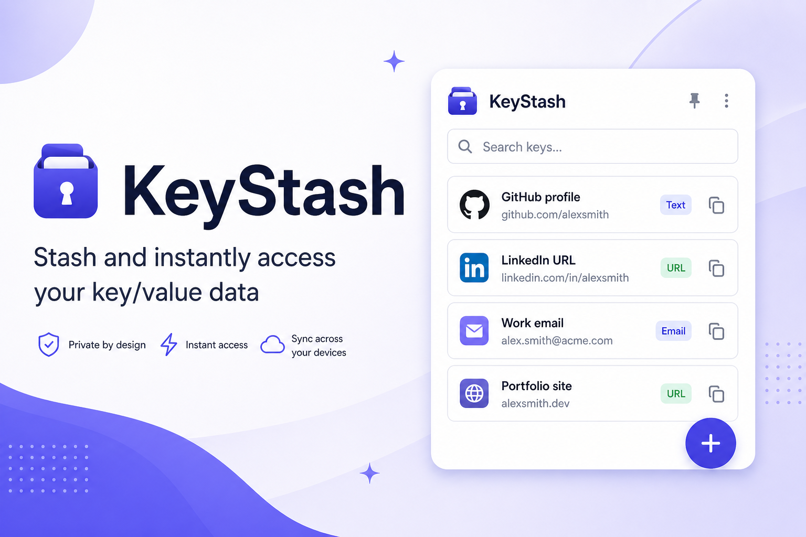
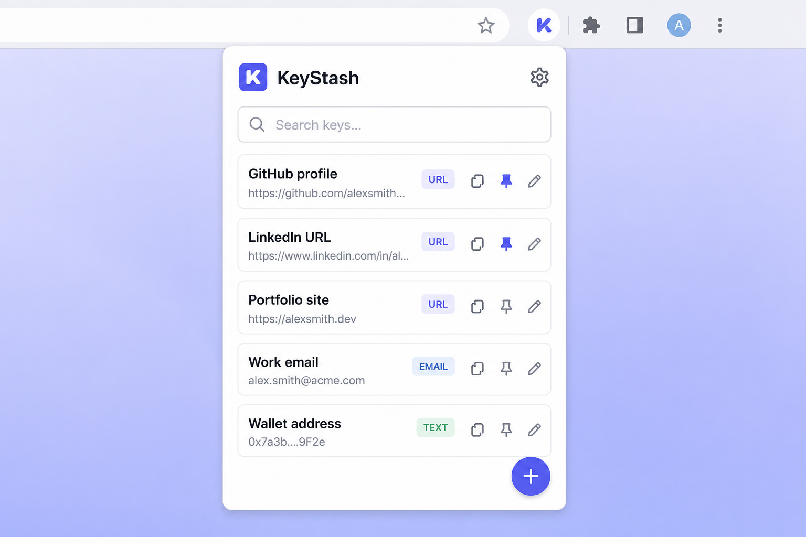
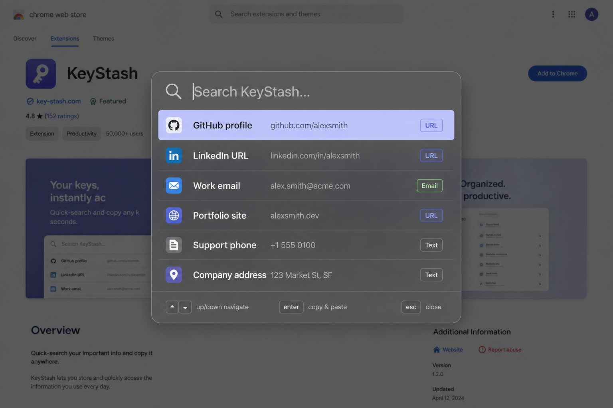

# KeyStash



> Stash and instantly access your on-demand key/value data — GitHub profile, LinkedIn URL, wallet address, license keys, and anything else you keep re-typing.

KeyStash is an open-source Chrome extension (Manifest V3) that stores small pieces of information as named key/value pairs and lets you copy or paste them anywhere in a couple of keystrokes. Your data is stored in `chrome.storage.sync`, so it follows you across every Chrome you're signed into.

> [!WARNING]
> **Do not store sensitive data in KeyStash.** All values are saved in **plain text** in `chrome.storage.sync` and are not encrypted. Avoid passwords, secret keys, API tokens, private keys, or any confidential information. Use a dedicated password manager for secrets.

## Features

<p align="center">
  
</p>

- **Popup manager** — a searchable list of all your stored keys with one-click copy.
- **Typed values with validation** — pick a type (Text, Number, URL, Email, UUID, Date, Time, Date & Time, or Other) and KeyStash validates the value with [Zod](https://zod.dev) before saving. "Other" is free-form.
- **Pinning** — pin the keys you use most so they float to the top.
- **Context menu** — optionally expose pinned keys in the right-click menu on any page to copy them instantly.

<p align="center">
  
</p>

- **Spotlight search** — press <kbd>Ctrl/Cmd</kbd> + <kbd>Shift</kbd> + <kbd>K</kbd> to open a macOS-Spotlight-style overlay on the current page. Search, hit <kbd>Enter</kbd>, and the value is copied to your clipboard **and pasted into whatever input you were focused on**.
- **CSV export** — download a backup of everything from the settings page.
- **Cross-device sync** — data lives in `chrome.storage.sync` and syncs to your signed-in Chrome browsers automatically.
- **Dark mode** — the popup, options page, and spotlight all respect your system theme.

## Tech stack

- [Vite](https://vitejs.dev) + [React](https://react.dev) + [TypeScript](https://www.typescriptlang.org)
- [Zod](https://zod.dev) for value validation
- [Tailwind CSS v4](https://tailwindcss.com) for the popup and options UI
- [@crxjs/vite-plugin](https://crxjs.dev) for Manifest V3 bundling and HMR
- Chrome Manifest V3 (service worker, content script, commands, context menus)

## Project structure

```
KeyStash/
├─ manifest.config.ts        # Typed MV3 manifest (permissions, commands, entry points)
├─ vite.config.ts
├─ scripts/generate-icons.mjs # Regenerates public/icons from images/keystash-icon.png
├─ public/icons/             # Extension icons
└─ src/
   ├─ background.ts          # Service worker: context menu + shortcut command
   ├─ popup/                 # Popup UI (list, search, add/edit form)
   ├─ options/               # Settings page (context menu, CSV export, usage)
   ├─ content/               # Spotlight overlay content script (shadow DOM)
   ├─ components/            # Shared UI (icons, toast)
   └─ lib/                   # types, storage, validators, csv, messages, clipboard
```

## Getting started

### Prerequisites

- Node.js 20+ and npm (an `.nvmrc` is included — run `nvm use` to match)

### Install & build

```bash
npm install
npm run build
```

This produces a `dist/` folder containing the unpacked extension.

### Load it in Chrome

1. Open `chrome://extensions`.
2. Enable **Developer mode** (top-right).
3. Click **Load unpacked** and select the `dist/` folder.
4. Pin KeyStash to your toolbar and start stashing.

### Develop with hot reload

```bash
npm run dev
```

Then load the `dist/` folder as above. `@crxjs/vite-plugin` provides HMR for the popup/options and live reloading for the background and content scripts. (You may need to reload the extension in `chrome://extensions` after some background/manifest changes.)

### Type-check

```bash
npm run typecheck
```

## Keyboard shortcuts

| Action | Shortcut (default) |
| --- | --- |
| Open Spotlight search | <kbd>Ctrl/Cmd</kbd> + <kbd>Shift</kbd> + <kbd>K</kbd> |
| Open the popup | <kbd>Ctrl/Cmd</kbd> + <kbd>Shift</kbd> + <kbd>S</kbd> |

To customize them, visit `chrome://extensions/shortcuts` (there's a shortcut to this page in KeyStash settings). Note: the Spotlight overlay cannot appear on restricted pages such as `chrome://` pages or the Chrome Web Store, since extensions can't inject scripts there.

## Data model

Each stored item is a `KeyItem`:

```ts
interface KeyItem {
  id: string;
  name: string;        // the key, e.g. "GitHub profile"
  value: string;       // stored as a string, validated by type
  type: ValueType;     // text | number | url | email | uuid | date | time | datetime | other
  pinned: boolean;
  inContextMenu: boolean;
  createdAt: number;
  updatedAt: number;
}
```

Items are stored under individual `ks:item:<id>` keys with an `ks:index` list, which spreads data across `chrome.storage.sync`'s per-item limit.

## A note on sync limits

`chrome.storage.sync` is convenient but intentionally small:

- ~100 KB total
- ~8 KB per item
- ~512 items

KeyStash shows your current usage in **Settings → Sync storage**. If you need to store large blobs, KeyStash may not be the right fit — it's designed for many small, frequently-needed snippets.

## Permissions & why they're needed

| Permission | Reason |
| --- | --- |
| `storage` | Store and sync your keys via `chrome.storage.sync`. |
| `contextMenus` | Add pinned keys to the right-click menu. |
| `scripting` | Copy a value into the page from the background worker / context menu. |
| `clipboardWrite` | Copy values to the clipboard. |
| `activeTab` | Interact with the current tab for the Spotlight overlay. |
| `host_permissions: <all_urls>` | Inject the Spotlight overlay and paste into inputs on any site. |

## Contributing

Contributions are welcome! Please:

1. Fork the repo and create a feature branch.
2. Run `npm run typecheck` and `npm run build` before opening a PR.
3. Keep changes focused and describe the motivation in your PR.

## Security notice

> [!WARNING]
> **Do not store sensitive data in KeyStash.** All values are saved in **plain text** in `chrome.storage.sync` and are not encrypted. Anyone with access to your Chrome profile (or your synced Google account) can read them. Never store passwords, secret/API keys, private keys, recovery phrases, or other confidential information — use a dedicated password manager for those.

## License

[MIT](./LICENSE) © KeyStash contributors
